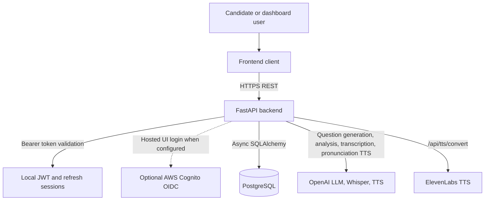
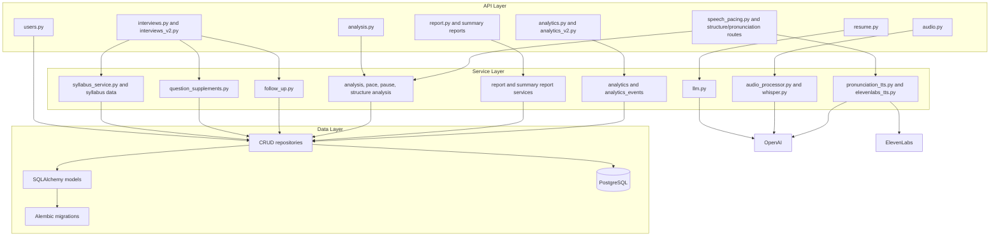

# System Architecture

Samvaad Sathi is a modular FastAPI service. HTTP routes validate requests and ownership, services perform business logic and AI calls, repositories own database access, and SQLAlchemy models define persisted state.

## System Context

## Component Architecture

## Data Flow

1. The client authenticates through local login or optional Cognito login.
2. Protected routes use `get_current_user` to validate the JWT and load the local `User`.
3. Resume upload extracts text from PDF/text files, asks the LLM for structured skills and experience, and stores results on `user`.
4. Interview creation stores an `interview`; question generation stores `interview_question` rows and V2 `question_attempt` rows.
5. Audio submission validates ownership, validates file type/size/duration, sends bytes to Whisper, stores transcription JSON on `question_attempt`, then deletes the temporary file.
6. Analysis endpoints read transcription data, run LLM and rule-based analyses, and persist results in `question_attempt.analysis_json` or report tables.
7. Reporting endpoints synthesize interview-level feedback from questions, attempts, analyses, and summary report records.
8. Analytics endpoints aggregate users, interviews, attempts, reports, and analytics events for dashboard views.

## Current Boundaries

- There is no durable object-storage integration for audio in the running app.
- The current ASR path uses OpenAI Whisper API, not a self-hosted or fine-tuned Whisper model.
- The current app uses PostgreSQL through `src/repository/database.py`.
- Cognito is optional and complements local users; it is not the only authentication path.
- `backend/docs/*.png` files are generated diagram artifacts. Treat Mermaid and Markdown sources as authoritative.
