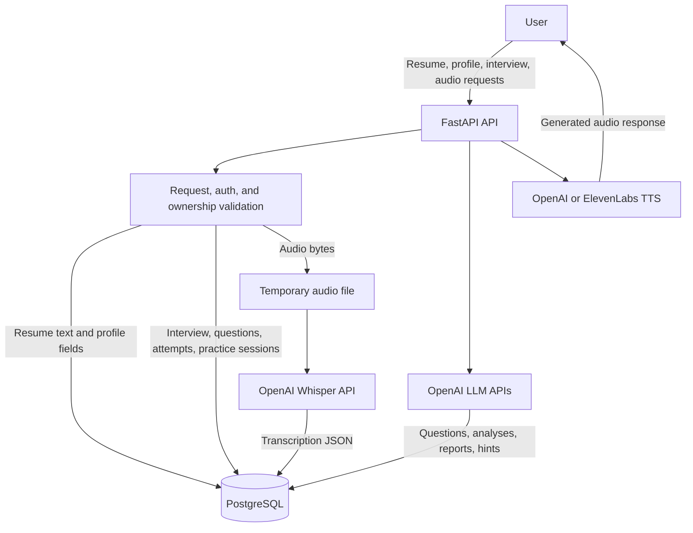

# Data Architecture and Training Roadmap

This document separates live data behavior from planned research work. The current backend does not implement object storage, dataset ingestion, model fine-tuning, GOP scoring, or custom ASR training.

## Current Data Architecture

Live storage:

- PostgreSQL stores users, sessions, interviews, questions, attempts, supplements, reports, practice sessions, job profiles, and analytics events.
- Resume text, skills, and years of experience are stored on the user record.
- Audio is validated and written to a temporary file for processing, then deleted.
- `question_attempt.audio_url` stores a generated reference name, not a durable URL.
- Transcription and analysis JSON are stored on question attempts.

## Implemented Analysis Signals

- Domain analysis through LLM prompting.
- Communication analysis through LLM prompting.
- Pace feedback from transcript/timing data.
- Pause analysis from word timestamp gaps when available.
- Structure-practice section analysis for C-T-E-T-D, STAR, and GCDIO frameworks.
- Summary reports that aggregate interview-level performance.

## Planned or Research-Only Items

These are not current production features:

- S3 or MinIO object storage for raw audio.
- Audio normalization pipeline using FFmpeg or Librosa.
- NPTEL2020 ingestion.
- Whisper fine-tuning, LoRA adapters, or custom ASR weights.
- Goodness of Pronunciation scoring from model internals.
- Mispronunciation Detection and Diagnosis at phoneme level.
- User opt-in training feedback loop.
- Automated right-to-forget scripts for external blob storage.

## Future Training Roadmap

If the project adds model adaptation later, use this sequence:

1. Add explicit user consent and retention policy.
2. Add durable object storage with per-user access controls and delete workflows.
3. Store audio metadata in PostgreSQL and raw objects outside the database.
4. Build an anonymization pipeline before any training export.
5. Validate dataset license and permitted use for NPTEL2020 or any other corpus.
6. Prototype evaluation offline before introducing any custom ASR path in the API.

## Governance Rules

- Do not use user audio for training without explicit consent.
- Do not document planned training features as live product behavior.
- Do not store raw audio permanently until retention, deletion, and access-control rules are implemented.
- Keep transcription and report outputs tied to authenticated user ownership.
